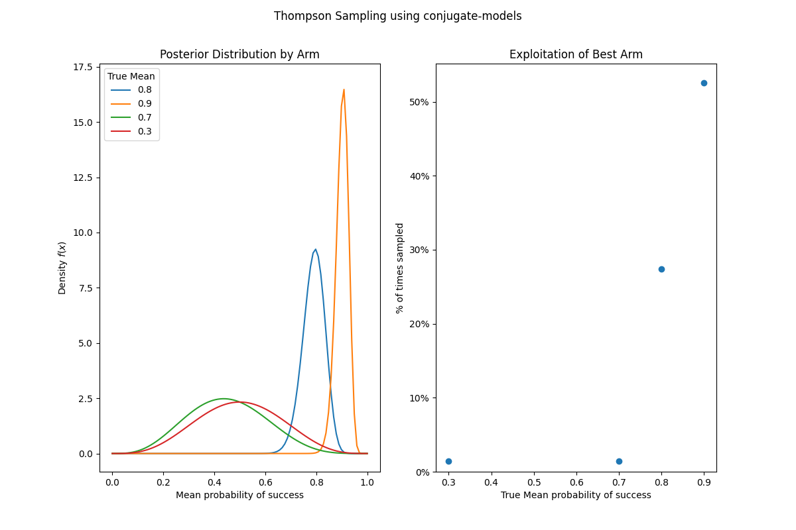

from conjugate.models import binomial_beta

# The multi-armed bandit problem

We will assume a Bernoulli distribution of successes for each arm
with an unknown average probability of success for each arm.

The conjugate prior of the Bernoulli distribution is a beta distribution

The goal is to find the arm with the highest probability of success.

```python
from conjugate.distributions import Beta, Binomial
from conjugate.models import bernoulli_beta, binomial_beta

import numpy as np
import matplotlib.pyplot as plt

# Define true probabilities of success for each arm
p = np.array([0.8, 0.9, 0.7, 0.3])
n_arms = len(p)
true_dist = Binomial(n=1, p=p)

```

Helper functions:

- sampling from the true distribution of given arm
- create the statistics required for Bayesian update of exponential gamma model
- single step in the Thompson sampling process

```python
def sample_true_distribution(
    arm_to_sample: int,
    rng,
    true_dist: Binomial = true_dist,
) -> float:
    return true_dist[arm_to_sample].dist.rvs(random_state=rng)


def bayesian_update_stats(
    arm_sampled: int,
    arm_sample: float,
    n_arms: int = n_arms,
) -> tuple[np.ndarray, np.ndarray]:
    x = np.zeros(n_arms)
    n = np.zeros(n_arms)

    x[arm_sampled] = arm_sample
    n[arm_sampled] = 1

    return x, n


def thompson_step(estimate: Beta, rng) -> Beta:
    sample = estimate.dist.rvs(random_state=rng)

    arm_to_sample = np.argmax(sample)
    arm_sample = sample_true_distribution(arm_to_sample, rng=rng)
    x, n = bayesian_update_stats(arm_to_sample, arm_sample)

    return binomial_beta(n=n,x=x, prior=estimate)
```

After defining a prior / initial estimate for each of the distributions, we can use a for loop in
order to perform the Thompson sampling and progressively update this estimate.

```python
alpha = np.ones(n_arms)*0.5
beta = np.ones(n_arms)*0.5
estimate = Beta(alpha, beta)

rng = np.random.default_rng(42)

total_samples = 250
for _ in range(total_samples):
    estimate = thompson_step(estimate=estimate, rng=rng)
```

We can see that the arm with the highest  probability of success was actually exploited the most!

```python

fig, axes = plt.subplots(ncols=2)
fig.suptitle("Thompson Sampling using conjugate-models")

ax = axes[0]
estimate.set_max_value(1).plot_pdf(label=p, ax=ax)
ax.legend(title="True Mean")
ax.set(
    xlabel="Mean probability of success",
    title="Posterior Distribution by Arm",
)

ax = axes[1]
n_times_sampled = estimate.alpha - 1
ax.scatter(p, n_times_sampled / total_samples)
ax.set(
    xlabel="True Mean probability of success",
    ylabel="% of times sampled",
    ylim=(0, None),
    title="Exploitation of Best Arm",
)
# Format yaxis as percentage
ax.yaxis.set_major_formatter(plt.FuncFormatter(lambda x, _: f"{x:.0%}"))
plt.show()
```

