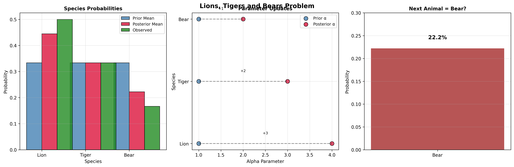

# Lions, Tigers and Bears: From Think Bayes Chapter 18

This example ports the Lions, Tigers and Bears problem from Allen Downey's [Think Bayes Chapter 18](https://allendowney.github.io/ThinkBayes2/chap18.html#lions-and-tigers-and-bears) to demonstrate the Dirichlet-Multinomial conjugate relationship.

The problem: estimating the prevalence of different animal species in a wildlife preserve, given observed counts. The Dirichlet distribution serves as the conjugate prior for the Multinomial likelihood, extending the Beta-Binomial concept to multiple categories.

## Import modules

Import the required distributions and functions:

- `Dirichlet`: Prior and posterior distribution for species probabilities
- `Multinomial`: Likelihood function for species counts
- `DirichletMultinomial`: Predictive distribution for multinomial model
- `multinomial_dirichlet`: Posterior update function
- `multinomial_dirichlet_predictive`: Predictive distribution function

```python
from conjugate.distributions import Dirichlet, Multinomial, DirichletMultinomial
from conjugate.models import multinomial_dirichlet, multinomial_dirichlet_predictive

import matplotlib.pyplot as plt
import numpy as np
import pandas as pd
```

## Observed Data

From Think Bayes: during a tour we observed 3 lions, 2 tigers, and 1 bear. We want to estimate the prevalence (probability) of each species.

```python
# Animal observation data
observed_counts = np.array([3, 2, 1])  # [lions, tigers, bears]
species_names = ['Lion', 'Tiger', 'Bear']
total_observed = observed_counts.sum()

print(f"Observed counts: {dict(zip(species_names, observed_counts))}")
print(f"Total animals observed: {total_observed}")
```

**Output**

```
Observed counts: {"Lion": 3, "Tiger": 2, "Bear": 1}
Total animals observed: 6
```

## Bayesian Inference

### Posterior Distribution

Using the Dirichlet-Multinomial conjugate relationship, we update our prior with observed counts. The posterior is also a Dirichlet distribution:

```python
# Prior: Uniform Dirichlet(alpha=[1, 1, 1]) from Think Bayes
prior = Dirichlet(alpha=np.array([1, 1, 1]))

# Posterior update using conjugate relationship
posterior = multinomial_dirichlet(x=observed_counts, prior=prior)
```

**Output:**
```
Prior parameters: alpha=[1 1 1]
Posterior parameters: alpha=[4 3 2]
Prior mean probabilities: [0.333 0.333 0.333]
Posterior mean probabilities: [0.444 0.333 0.222]
```

# Display as DataFrame for clarity

```python
results_df = pd.DataFrame({
    'Species': species_names,
    'Observed': observed_counts,
    'Prior Mean': prior.dist.mean(),
    'Posterior Mean': posterior.dist.mean(),
    'Observed Proportion': observed_counts / total_observed
}).set_index("Species")
print(results_df.round(3))
```

**Output:**
```

         Observed  Prior Mean  Posterior Mean  Observed Proportion
Species
Lion            3       0.333           0.444                0.500
Tiger           2       0.333           0.333                0.333
Bear            1       0.333           0.222                0.167
```

The posterior follows the simple conjugate update rule:
`α_posterior = α_prior + observed_counts`

### Predictive Distribution

Get the predictive distribution for future observations:

```python
# Predictive distribution for next 10 animals
n_future = 10
posterior_predictive = multinomial_dirichlet_predictive(
    n=n_future,
    distribution=posterior
)

print(f"Expected composition of next {n_future} animals:")
expected_composition = posterior_predictive.dist.mean()
print(dict(zip(species_names, expected_composition.round(2))))
```

**Output:**
```
Expected composition of next 10 animals:
{"Lion": 4.44, "Tiger": 3.33, "Bear": 2.22}
```

## Additional Analysis

### Probability of Next Animal Being a Bear

**Output:**
```
Probability next animal is a bear: 0.222

Probability distribution for next animal:
  Lion: 0.444
  Tiger: 0.333
  Bear: 0.222
```

### Visualization

Create comprehensive visualizations of the analysis:



*Figure: Comprehensive Dirichlet-Multinomial analysis showing parameter updates (α+=counts), posterior mean probabilities, and the 22.2% probability that the next animal observed will be a bear.*

## Connection to Think Bayes

### The Multivariate Conjugate Advantage

The Dirichlet-Multinomial conjugate extends the Beta-Binomial concept to multiple categories:

- **Univariate**: Beta prior for single probability `p` with Binomial likelihood
- **Multivariate**: Dirichlet prior for probability vector `p` with Multinomial likelihood

In Think Bayes, this would require:
1. Creating a 3D grid of probability combinations
2. Ensuring probabilities sum to 1 at each grid point
3. Computing multinomial likelihood everywhere
4. Complex normalization

With conjugate-models:
```python
posterior = multinomial_dirichlet(x=observed_counts, prior=prior)
```

### Mathematical Intuition

The Dirichlet-Multinomial conjugate works because both involve products of probabilities raised to powers:

- Dirichlet prior: ∏ p_i^(α_i-1)
- Multinomial likelihood: ∏ p_i^x_i
- Posterior: ∏ p_i^(α_i-1+x_i)

This gives the simple vector update:
`α_posterior = α_prior + observed_counts`

### What the Parameters Mean

- `α_i` (alpha_i): "pseudo-counts" for species i - prior beliefs about each species
- Sum `Σα_i`: Represents the strength of prior belief (equivalent sample size)
- The ratio `α_i/(Σα_i)` gives the expected probability for species i

### Key Insights

1. **Bear Probability**: The probability the next animal is a bear is simply the posterior mean for bears: `(1+1)/(3+6) = 2/9 ≈ 22.2%`

2. **Correlation Structure**: The Dirichlet induces negative correlations between species probabilities (since they must sum to 1)

3. **Learning Behavior**: With more data, the posterior becomes more concentrated around the observed proportions

This example beautifully demonstrates how conjugate priors extend naturally to multivariate problems, turning potentially complex calculations into simple vector arithmetic.

---

*This example is inspired by Allen Downey's Think Bayes, Chapter 18: [Conjugate Priors](https://allendowney.github.io/ThinkBayes2/chap18.html)*
