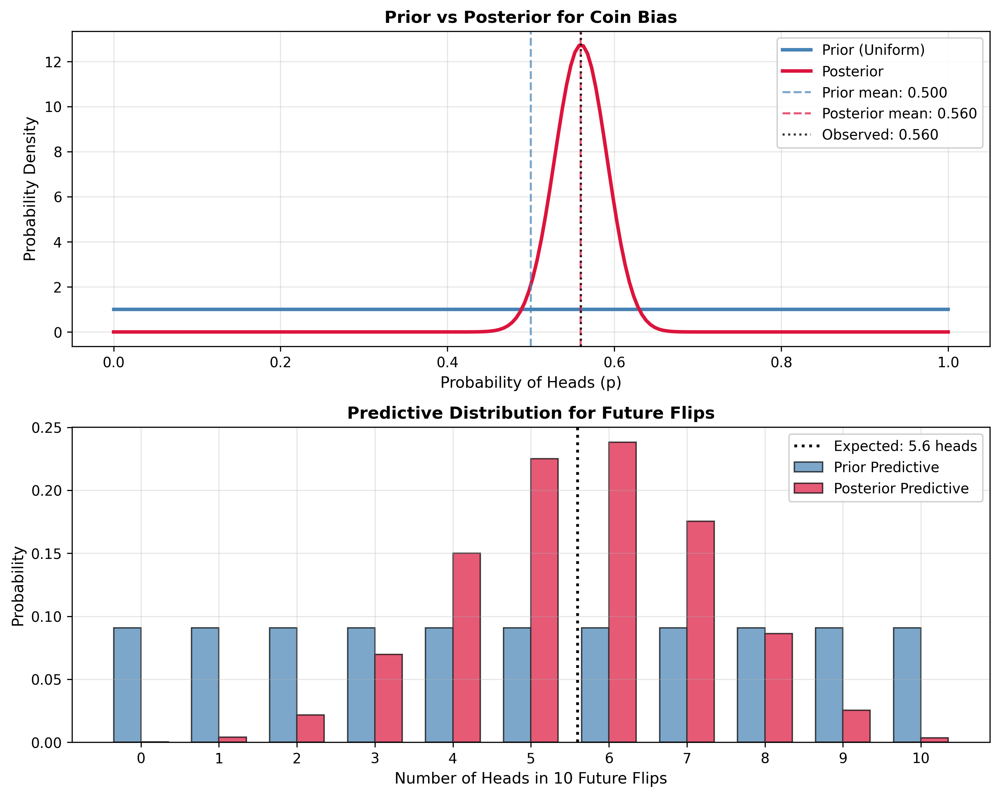

# Euro Problem: From Think Bayes Chapter 18

This example ports the Euro problem from Allen Downey's [Think Bayes Chapter 18](https://allendowney.github.io/ThinkBayes2/chap18.html#binomial-likelihood) to demonstrate the Beta-Binomial conjugate relationship.

The problem: estimating the probability of a coin landing heads up, given 140 heads out of 250 flips. The Beta distribution serves as the conjugate prior for the Binomial likelihood, making Bayesian updates trivial.

## Import modules

Import the required distributions and functions:

- `Beta`: Prior and posterior distribution for success probability
- `Binomial`: Likelihood function for coin flips
- `BetaBinomial`: Predictive distribution for binomial model
- `binomial_beta`: Posterior update function
- `binomial_beta_predictive`: Predictive distribution function

```python
from conjugate.distributions import Beta, Binomial, BetaBinomial
from conjugate.models import binomial_beta, binomial_beta_predictive

import matplotlib.pyplot as plt
import numpy as np
```

## Observed Data

From Think Bayes: 140 heads out of 250 coin flips. We're estimating the probability `p` of getting heads.

```python
# Euro coin data: 140 heads out of 250 flips
x = 140  # number of successes (heads)
n = 250   # number of trials (flips)
```

## Bayesian Inference

### Posterior Distribution

Using the Beta-Binomial conjugate relationship, we update our prior with the observed data. The posterior is also a Beta distribution with updated parameters:

```python
# Prior: Uniform distribution Beta(alpha=1, beta=1) from Think Bayes
prior = Beta(alpha=1, beta=1)

# Posterior update using conjugate relationship
posterior = binomial_beta(n=n, x=x, prior=prior)

print(f"Prior parameters: alpha={prior.alpha}, beta={prior.beta}")
print(f"Posterior parameters: alpha={posterior.alpha}, beta={posterior.beta}")
print(f"Prior mean: {prior.mean():.3f}")
print(f"Posterior mean: {posterior.mean():.3f}")
print(f"Observed proportion: {x/n:.3f}")
```

**Output:**
```
Prior parameters: alpha=1, beta=1
Posterior parameters: alpha=141, beta=111
Prior mean: 0.500
Posterior mean: 0.560
Observed proportion: 0.560
```

The posterior follows the simple conjugate update rule:

- `α_posterior = α_prior + x` (adding observed heads)
- `β_posterior = β_prior + (n - x)` (adding observed tails)

### Predictive Distribution

Get the predictive distribution for future coin flips:

```python
# Predictive distribution for next 10 flips
n_future = 10
posterior_predictive = binomial_beta_predictive(
    n=n_future,
    distribution=posterior
)

print(f"Predicted heads in {n_future} flips: {posterior_predictive.mean():.2f}")
```

**Output:**
```
Predicted heads in 10 flips: 5.60
```

## Additional Analysis

Compare prior, posterior, and predictive distributions:



*Figure: Beta-Binomial conjugate analysis showing how observing 140 heads in 250 flips updates from a uniform prior to a Beta(141,111) posterior, with 95% credible interval and predictive distributions.*

### Credible Interval

Calculate a 95% credible interval for coin bias:

**Output:**
```
95% Credible Interval: [0.498, 0.622]
Interval width: 0.124
```

This narrow interval (width: 0.124) shows increased confidence after observing 250 flips, concentrating our belief around the observed proportion of 0.560.

## Connection to Think Bayes

### The Conjugate Advantage

In Think Bayes, the grid method requires:
1. Creating a grid of probability values
2. Computing binomial likelihood for each probability
3. Multiplying prior × likelihood and normalizing
4. Complex visualization code

With conjugate-models:
```python
posterior = binomial_beta(n=250, x=140, prior=prior)
```

### Mathematical Intuition

The Beta-Binomial conjugate works because both share the same functional form:

- Beta prior: p^(α-1) (1-p)^(β-1)
- Binomial likelihood: p^k (1-p)^(n-k)
- Posterior: p^(α-1+k) (1-p)^(β-1+n-k)

This gives the simple update rules:

- `α_posterior = α_prior + successes`
- `β_posterior = β_prior + failures`

### What the Parameters Mean

- `α` (alpha): "pseudo-successes" - prior beliefs about heads
- `β` (beta): "pseudo-failures" - prior beliefs about tails
- The ratio `α/(α+β)` gives the expected probability of heads
- The sum `α+β` represents the strength of prior belief (equivalent sample size)

### Comparison with Grid Method

The grid method from Think Bayes requires discretizing the probability space and computing likelihoods at each point. The conjugate approach:

1. **Computationally Efficient**: O(1) vs O(grid_size) operations
2. **Exact Solution**: No discretization error
3. **Analytical Properties**: Easy to compute moments, credible intervals
4. **Scalable**: Works equally well for any data size

This example showcases the elegance and efficiency of conjugate Bayesian analysis compared to grid approximation methods.

---

*This example is inspired by Allen Downey's Think Bayes, Chapter 18: [Conjugate Priors](https://allendowney.github.io/ThinkBayes2/chap18.html)*
