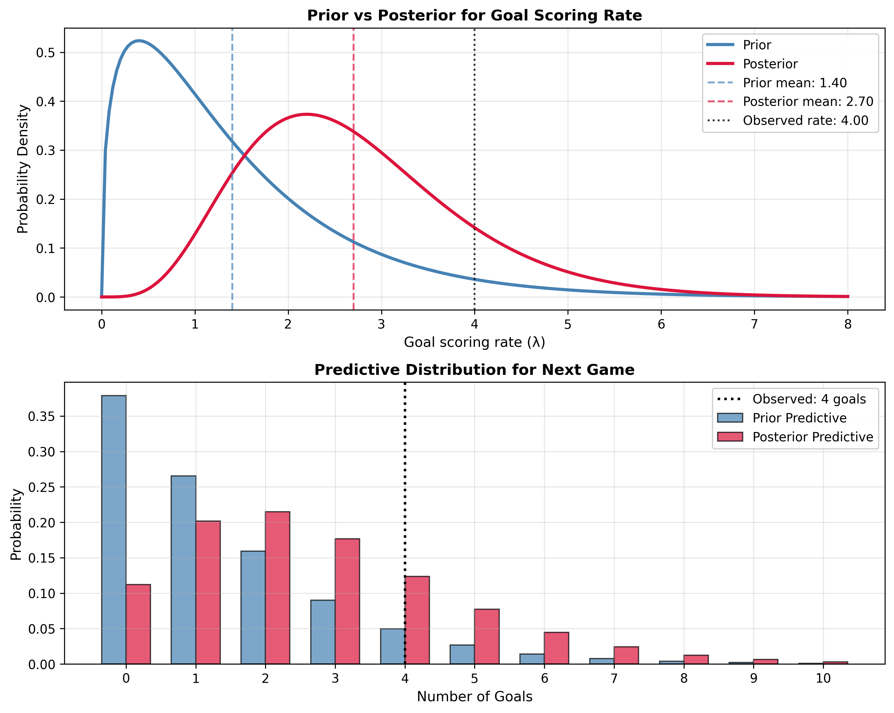

# World Cup Problem: From Think Bayes Chapter 18

This example ports the World Cup problem from Allen Downey's [Think Bayes Chapter 18](https://allendowney.github.io/ThinkBayes2/chap18.html#the-world-cup-problem-revisited) to demonstrate the power of conjugate priors for Poisson processes.

The problem: modeling goal-scoring rates in soccer games using a Poisson process, where the gamma distribution serves as the conjugate prior. What takes complex grid computations in the original can be solved with simple parameter updates using conjugate-models.

## Import modules

Import the required distributions and functions:

- `Gamma`: Prior distribution for Poisson rate parameter
- `Poisson`: Likelihood function for goal counts
- `GammaPoisson`: Predictive distribution for Poisson model
- `poisson_gamma`: Posterior update function
- `poisson_gamma_predictive`: Predictive distribution function

```python
from conjugate.distributions import Gamma, Poisson
from conjugate.models import poisson_gamma, poisson_gamma_predictive

import matplotlib.pyplot as plt
import numpy as np
```

## Observed Data

From Think Bayes: Germany vs Brazil 2014 World Cup where Brazil scored 4 goals. The data represents the total goals (`x_total`) observed over a time period (`n` games).

```python
# World Cup data: Brazil scored 4 goals in 1 game
x_total = 4
n_games = 1
```

## Bayesian Inference

### Posterior Distribution

Using the Gamma-Poisson conjugate relationship, we can update our prior with the observed data. The beauty of conjugate priors is that the posterior is also a Gamma distribution with updated parameters:

```python
# Prior: Gamma(alpha=1.4, beta=1) from Think Bayes
prior = Gamma(alpha=1.4, beta=1)

# Posterior update using conjugate relationship
posterior = poisson_gamma(x_total=x_total, n=n_games, prior=prior)

print(f"Prior parameters: alpha={prior.alpha}, beta={prior.beta}")
print(f"Posterior parameters: alpha={posterior.alpha}, beta={posterior.beta}")
print(f"Prior mean: {prior.mean():.3f}")
print(f"Posterior mean: {posterior.mean():.3f}")
```

The posterior parameters follow the simple conjugate update rule:
- `α_posterior = α_prior + x_total` (adding observed goals)
- `β_posterior = β_prior + n_games` (adding observed time)

### Predictive Distribution

Get the predictive distribution for future games using the posterior:

```python
# Predictive distribution for next game
posterior_predictive = poisson_gamma_predictive
    n=1,
    distribution=posterior
)

print(f"Predicted goals in next game: {posterior_predictive.mean():.2f}")
```

## Additional Analysis

Compare prior and posterior distributions to see how the data updates our beliefs about goal-scoring rates:



*Figure: Prior vs Posterior distributions for goal-scoring rates, showing how observing 4 goals in 1 game updates our beliefs from a Gamma(1.4,1) prior to a Gamma(5.4,2) posterior.*

## Connection to Think Bayes

### The Conjugate Advantage

In Think Bayes, Allen Downey shows the grid method requiring:
1. Creating a grid of λ values
2. Computing Poisson likelihood for each λ
3. Multiplying prior × likelihood and normalizing
4. Multiple lines of complex code

With conjugate-models, this reduces to:
```python
posterior = poisson_gamma(x_total=4, n=1, prior=prior)
```

### Mathematical Intuition

The Gamma-Poisson conjugate relationship works because both distributions share the same functional form:
- Gamma prior: λ^(α-1) e^(-βλ)
- Poisson likelihood: λ^k e^(-λt)
- Posterior: λ^(α-1+k) e^(-λ(β+t))

This elegant mathematical property gives us the simple update rules:
- `α_posterior = α_prior + observed_goals`
- `β_posterior = β_prior + observed_time`

### What the Parameters Mean

- `α` (alpha): Represents "pseudo-goals" - prior knowledge about goal counts
- `β` (beta): Represents "pseudo-games" - prior knowledge about time periods
- The ratio `α/β` gives the expected goal-scoring rate

This example perfectly demonstrates why conjugate priors are so powerful - they turn complex Bayesian updates into simple arithmetic operations while maintaining full probabilistic inference.

---

*This example is inspired by Allen Downey's Think Bayes, Chapter 18: [Conjugate Priors](https://allendowney.github.io/ThinkBayes2/chap18.html)*
