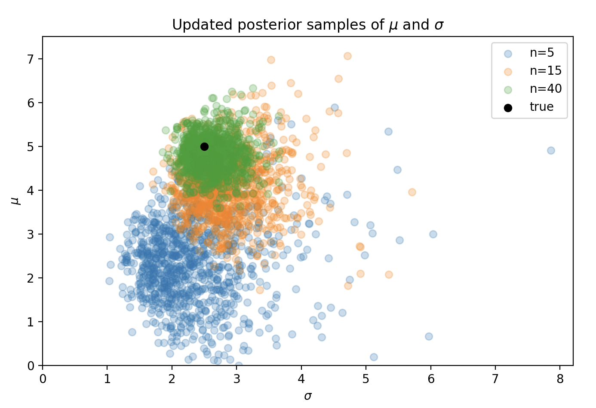
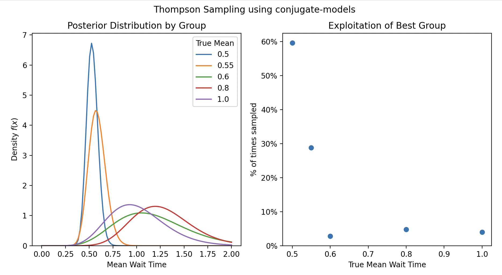

# Summary

`conjugate-models` is a modern Python package for Bayesian conjugate inference that prioritizes a clean, idiomatic API and seamless integration with widely used Python data analysis libraries. It implements the conjugate likelihood-prior pairs cataloged in Fink's compendium and Wikipedia's conjugate prior table, making rigorous Bayesian updating, exploration, and visualization accessible for practitioners, educators, and researchers. Comprehensive documentation, interactive examples, and an online Distribution Explorer further support flexible application and learning.

# Statement of need

Bayesian inference with conjugate priors offers a tractable and interpretable
approach to updating distributions in light of new evidence. While
general-purpose probabilistic programming frameworks exist, they can introduce
significant cognitive and computational overhead for common conjugate models. The `conjugate-models`
package is designed to provide efficient, intuitive, and didactic support for
Bayesian conjugate workflows across statistics, data science, and education,
allowing direct use with array-like objects from libraries such as
numpy[@harris2020array],
pandas[@The_pandas_development_team_pandas-dev_pandas_Pandas], and
polars[@polars2024]. The project also provides live interactive
documentation and an [online Distribution Explorer](https://williambdean.github.io/conjugate/explorer) for real-time model investigation.

A prior distribution is conjugate to a likelihood when the posterior remains in
the same distribution family after observing data[@raiffa1961applied].
Conjugate priors provide closed-form posterior updates and posterior predictive
distributions, eliminating the need for numerical
integration[@fink1997compendium]. Because these updates are analytic
rather than iterative, posterior computation is instantaneous regardless of
data size—enabling real-time interactive exploration and rapid model
iteration. `conjugate-models` implements the conjugate pairs cataloged in Fink's
compendium[@fink1997compendium] and Wikipedia's conjugate prior table.
The complete list of supported models is maintained at
[the online documentation](https://williambdean.github.io/conjugate/models/).

Python lacked a dedicated, user-friendly package making Bayesian conjugate
inference accessible, idiomatic, and didactically powerful—especially one
offering robust integration with common data tooling and interactive resources
for teaching and exploratory work. Existing educational tools for Bayesian
statistics often lack interactivity or require complex setup, making the
intuitive nature of conjugate priors difficult to convey to students and
practitioners new to Bayesian methods.

# Features & API Overview

`conjugate-models` provides an intuitive, pipeable API compatible with numpy arrays[@harris2020array], pandas DataFrames/Series[@The_pandas_development_team_pandas-dev_pandas_Pandas], polars DataFrames[@polars2024] (for element-wise operations), and general numerical types. The package includes vectorized and indexable operations for batch and multi-arm inference, built-in plotting for posterior, prior, and predictive distributions, and connection to scipy distributions for interoperability[@virtanen2020scipy].

A typical workflow follows a consistent pattern:

```python
from conjugate.distributions import SomeDistribution
from conjugate.models import some_model

prior: SomeDistribution = ...
data = ...
summary_stats = f(data)
posterior: SomeDistribution = some_model(*summary_stats, prior=prior)
```

# Example Usage

## Sequential Bayesian Updates

The package naturally supports sequential Bayesian learning, where each
posterior becomes the next prior. This example demonstrates real-time updating
for a binomial model with beta prior:

```python
from conjugate.distributions import Beta
from conjugate.models import binomial_beta

# Initial prior: uniform over [0, 1]
prior = Beta(alpha=1, beta=1)

# Observations: 3 successes in 5 trials, then 2 successes in 3 trials
observations = [(3, 5), (2, 3)]

posterior = prior
for successes, trials in observations:
    posterior = binomial_beta(n=trials, x=successes, prior=posterior)
    print(f"After {successes}/{trials}: α={posterior.alpha}, β={posterior.beta}")

# After 3/5: α=4.0, β=3.0
# After 2/3: α=6.0, β=4.0
```



## Thompson Sampling for Minimizing Wait Times

Thompson sampling is effective for exploration-exploitation problems where the
goal is optimization. This example demonstrates finding the group with minimum
wait time using exponential-gamma conjugate updates:

```python
from conjugate.distributions import Gamma, Exponential
from conjugate.models import exponential_gamma
import numpy as np

# Five groups with unknown exponential wait times
lam = np.array([0.5, 0.55, 0.6, 0.8, 1])  # True rates (hidden)
n_groups = len(lam)
true_dist = Exponential(lam=lam)

def thompson_step(estimate: Gamma, rng) -> Gamma:
    # Sample rate from posterior for each group
    sample = estimate.dist.rvs(random_state=rng)

    # Choose group with minimum expected wait time (highest rate)
    group_to_sample = np.argmin(sample)

    # Observe wait time from chosen group
    group_sample = true_dist[group_to_sample].dist.rvs(random_state=rng)

    # Prepare statistics for Bayesian update
    x = np.zeros(n_groups)
    n = np.zeros(n_groups)
    x[group_to_sample] = group_sample
    n[group_to_sample] = 1

    return exponential_gamma(x_total=x, n=n, prior=estimate)

# Initialize with uniform priors
alpha = beta = np.ones(n_groups)
estimate = Gamma(alpha, beta)

rng = np.random.default_rng(42)

# Thompson sampling over 250 iterations
for _ in range(250):
    estimate = thompson_step(estimate=estimate, rng=rng)
```



# Related Work

Several Python packages address aspects of Bayesian inference.
ArviZ[@Kumar2019] excels at posterior analysis and visualization but focuses on MCMC/variational inference outputs rather than conjugate models.
Bambi[@Capretto_Bambi_A_simple_2022] provides a high-level interface for Bayesian linear models via PyMC but targets more complex model specifications.
scikit-learn[@scikit-learn] includes some Bayesian methods but emphasizes frequentist machine learning.
General probabilistic programming languages like PyMC[@pymc2023] and Stan[@stan2025reference] offer comprehensive modeling capabilities but introduce substantial overhead for simple conjugate updates.

`conjugate-models` distinguishes itself by wrapping scipy.stats distributions with conjugate update semantics, plotting interfaces, and seamless integration into standard Bayesian workflows[@gelman2020workflow]. Its focused scope enables immediate posterior computation without MCMC or optimization, making it ideal for interactive exploration, education, and rapid prototyping of conjugate models.

# Limitations

This package specifically targets conjugate prior-likelihood pairs, so non-conjugate models require other tools like PyMC[@pymc2023] or Stan[@stan2025reference]. Model updates operate on sufficient statistics rather than raw data, requiring users to compute summary statistics beforehand. Distribution and parameter names follow established conventions from statistical literature[@fink1997compendium], which may differ from other packages. Community support is available through GitHub Issues and Discussions.

# Software Design

`conjugate-models` adopts a distribution-centric design where each probability distribution is a first-class object wrapping scipy.stats distributions while adding conjugate-specific functionality. Key design decisions include:

*Compositional API*: Rather than monolithic model classes, the package separates distributions (`conjugate.distributions`) from update logic (`conjugate.models`), allowing users to compose workflows naturally. This mirrors the mathematical structure where conjugate updates transform one distribution into another of the same family.

*Scipy Integration*: The `dist` property on each distribution class provides direct access to scipy.stats objects, enabling interoperability with the broader scientific Python ecosystem without reimplementing standard functionality like PDF computation, sampling, and statistical methods.

*Vectorized Operations*: Parameters accept array-like inputs (numpy arrays, pandas/polars columns), enabling batch inference for multi-arm problems like Thompson sampling without explicit loops. This design choice prioritizes performance for real-world applications involving multiple simultaneous models.

*Mixin Architecture*: Plotting capabilities are added via mixins (e.g., `ContinuousPlotDistMixin`, `DiscretePlotMixin`), keeping core distribution classes focused while enabling rich visualization. The `SliceMixin` provides indexing support for vectorized parameters.

*Helper Function Design*: The `helpers` module provides functions to extract sufficient statistics from raw observational data, bridging the gap between real-world datasets and the mathematical abstractions required for conjugate updates.

These design choices prioritize clarity and composability over abstraction, making the mathematical structure of conjugate inference explicit in the code while maintaining compatibility with the broader scientific Python ecosystem.

# Research Impact Statement

`conjugate-models` addresses a specific gap in the Python ecosystem for lightweight, immediate Bayesian inference without MCMC overhead. Evidence of research impact includes:

*Community Adoption*: The package is available on PyPI with sustained development over 2+ years (270+ commits since June 2023), comprehensive test coverage (94%), and active maintenance demonstrated through regular releases and bug fixes.

*Educational Value*: The package's didactic design supports teaching Bayesian concepts through immediate, interactive feedback. The live Distribution Explorer provides hands-on learning without installation requirements, making Bayesian inference more accessible to students and practitioners.

*Documentation and Examples*: Comprehensive documentation with 15+ worked examples demonstrates real-world applications from A/B testing to Thompson sampling, supporting both educational use and practical implementation.

*Technical Contributions*: The package implements the complete catalog of conjugate pairs from Fink's compendium[@fink1997compendium] with modern Python practices, providing a reference implementation for conjugate Bayesian inference that was previously unavailable in a single, cohesive package.

*Integration Capabilities*: Seamless compatibility with numpy, pandas, polars, and scipy enables integration into existing data science workflows without requiring users to learn new data structures or abandon familiar tools.

The package serves researchers, educators, and practitioners who need rapid, interpretable Bayesian inference for conjugate models, complementing rather than competing with general-purpose probabilistic programming frameworks.

# Acknowledgments

We thank the scientific Python community, particularly the maintainers and contributors of NumPy[@harris2020array], SciPy[@virtanen2020scipy], and Matplotlib, whose foundational libraries make this package possible. The examples showcase integration with pandas[@The_pandas_development_team_pandas-dev_pandas_Pandas], Polars[@polars2024], and PyMC[@pymc2023], demonstrating the collaborative spirit of the open-source ecosystem.

# AI Usage Disclosure

Generative AI tools were used during the development of this software and the preparation of this manuscript. All AI-assisted outputs were reviewed, edited, and validated by the human author, who made all core design decisions.

*Software Development*: GitHub Copilot Pro was used via the GitHub web interface for code suggestions and code review assistance. The majority of the codebase was written directly by the author without AI assistance.

*Documentation*: AI tools assisted with portions of the package documentation. The majority of documentation was written directly by the author.

*Paper Authoring*: opencode (version 1.0.220) with Claude Opus 4.5 was used to:
- Gather and organize information from existing documentation and the codebase during paper drafting
- Simulate peer review feedback via agent prompts to identify areas for improvement
- Iterate on paper structure, content, and clarity

*Human Oversight*: The author made all architectural and design decisions for the software, determined the scientific content and framing of the paper, and reviewed and validated all AI-assisted outputs before inclusion. No AI-generated code or text was included without human verification and editing.

# Availability

`conjugate-models` is available on PyPI: `pip install conjugate-models`. The package is open-source under the MIT license at [https://github.com/williambdean/conjugate](https://github.com/williambdean/conjugate), with contribution guidelines at [CONTRIBUTING.md](https://github.com/williambdean/conjugate/blob/main/CONTRIBUTING.md). Live documentation and an interactive Distribution Explorer are available at [https://williambdean.github.io/conjugate/](https://williambdean.github.io/conjugate/).
